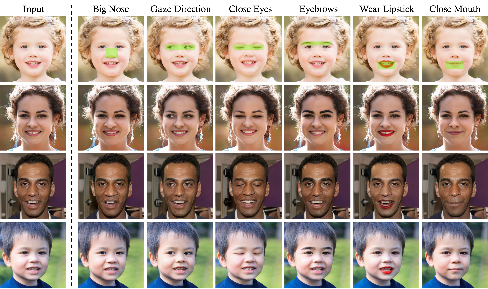

# Region-Based Semantic Factorization in GANs


**Figure:** *Image editing results using ReSeFa on BigGAN (first two columns) and StyleGAN2 (last three columns).*

> **Region-Based Semantic Factorization in GANs** <br>
> Jiapeng Zhu, Yujun Shen, Yinghao Xu, Deli Zhao, Qifeng Chen <br>
> *International Conference on Machine Learning (ICML) 2022* <br>

[[Paper](http://arxiv.org/abs/2202.09649)]
[[Project page](https://zhujiapeng.github.io/resefa/)]
[[Demo](https://youtu.be/Rsr0VJNvXW8)]
[[Colab](https://colab.research.google.com/github.com/zhujiapeng/resefa/tree/main/docs/resefa.ipynb)]

In the repository, we propose a simple algorithm to interpret the region-based semantics learned by GANs. In particular, we re-examine the task of local editing with pre-trained GAN models, and formulate region-based semantic discovery as a dual optimization problem. Through an appropriately defined generalized Rayleigh quotient, we are able to tackle such a problem super efficiently with a closed-form solution. Extensive experiments on BigGAN and StyleGAN2 demonstrate the effectiveness and robustness of our proposed method.

## Local Face Editing Results



**Figure:** *Semantics found by ReSeFa with respect to the region of interest (i.e., within the green boxes).*

## Usage

### Pre-trained Models

This repository is based on [Hammer](https://github.com/bytedance/Hammer), where you can find detailed instructions on environmental setup. Please refer [here](https://github.com/bytedance/Hammer/blob/main/docs/model_conversion.md) for model downloading and conversion, and use the script `synthesis.py` to check whether the model is ready for use as

```bash
MODEL_PATH='stylegan2-ffhq-config-f-1024x1024.pth'
python synthesis.py ${MODEL_PATH} --stylegan2
```

### Editing with Provided Directions

We have provided some *local* semantic directions under the directory `directions/`, which are discovered from the officially released StyleGAN2/StyleGAN3 models. Users can use these directions for image local editing. For example,

- Manipulation on StyleGAN2 FFHQ

  ```bash
  MODEL_PATH='stylegan2-ffhq-config-f-1024x1024.pth'
  DIRECTION='directions/ffhq/stylegan2/eyesize.npy'
  python manipulate.py ${MODEL_PATH} ${DIRECTION} --stylegan2
  ```

- Manipulation on StyleGAN3-R AFHQ

  ```bash
  MODEL_PATH='stylegan3-r-afhqv2-512x512.pth'
  DIRECTION='directions/afhq/stylegan3/eyes-r.npy'
  python manipulate.py ${MODEL_PATH} ${DIRECTION} \
      --stylegan3 --cfg R --img_size 512 --data_name afhq
  ```

### Finding Your Own Directions

To explore more directions, please follow the following steps, which use the FFHQ model officially released in [StyleGAN2](https://github.com/NVlabs/stylegan2) as an example.

- Step-1: Compute Jacobian with one/several *random* syntheses.

  ```bash
  MODEL_PATH='stylegan2-ffhq-config-f-1024x1024.pth'
  python compute_jacobian.py ${MODEL_PATH} --stylegan2
  ```

- Step-2: Discover semantic directions from the Jacobian.

  ```bash
  JACOBIAN_PATH='work_dirs/jacobians/ffhq/jacobians_w.npy'
  python compute_directions.py ${JACOBIAN_PATH}
  ```

- Step-3: Verify the directions via image manipulation

  ```bash
  MODEL_PATH='stylegan2-ffhq-config-f-1024x1024.pth'
  DIRECTION_PATH='work_dirs/directions/ffhq/eyes/${DIRECTION_NAME}'
  python manipulate.py ${MODEL_PATH} ${DIRECTION} --stylegan2
  ```

## BibTeX

```bibtex
 @inproceedings{zhu2022resefa,
  title     = {Region-Based Semantic Factorization in {GAN}s},
  author    = {Zhu, Jiapeng and Shen, Yujun and Xu, Yinghao and Zhao, Deli and Chen, Qifeng},
  booktitle = {International Conference on Machine Learning (ICML)},
  year      = {2022}
}
```
